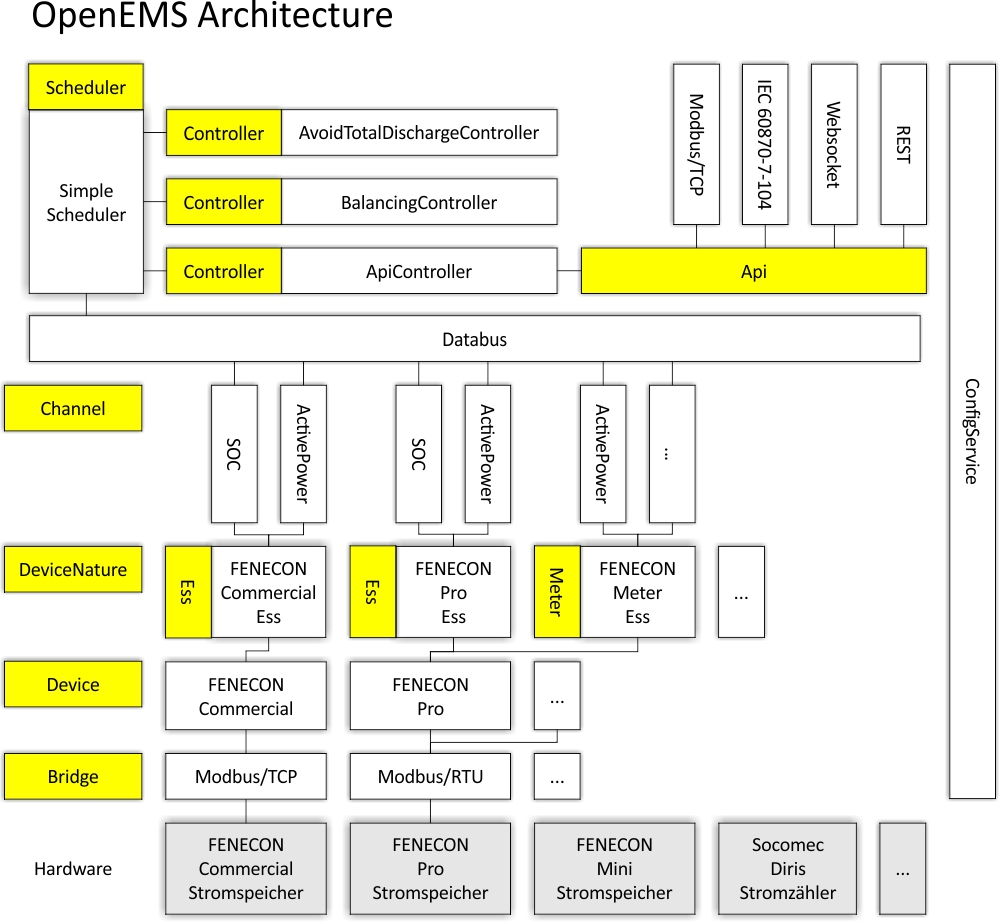

# OpenEMS Edge Architecture

The Edge component is responsible for communicating with and controling of external hardware like battery systems, inverters, meters and so on. With the implemented software architecture it is abstracting device communication and control algorithms in a way to provide maximum flexibility; e.g. the same algorithms can be used with different inverters.

- Hardware (battery systems, inverters, meters,…) or external services are at the bottom of the graph.
- A "**Bridge**" is the physical connection layer to a device (like Modbus/TCP or RTU). There can be several devices per Bridge.
- A "**Device**" is representing an external hardware or service.
- A device can have several "**DeviceNatures**". For example a FENECON Pro storage system is integrating a battery as well as a meter.
- A nature has a "**Channel**" for each single information, which can be readonly (State of charge of a battery, current active power,…) and writable (set active power, switch of relay output)
- Central interface is the "**Databus**", where all events (like changed values of a channels) are registered and commands are forwarded.
- The actual business logic is in the "**Controller**", where each of them holds specific, encapsulated tasks:
  - "Controllers are Apps that are logically binding the Channels and the functionality." For example: switching a relay output, charging the battery,…
  -	"AvoidTotalDischargeController" takes care of the secure function of a storage system
  -	"BalancingController" optimizes the self-consumption at the grid meter
  - "ApiController" receives commands from external control units
- The "**Scheduler**" is planning and executing the controllers according to the defined, dynamic priorities.
- The configuration sits in a central JSON config file.
